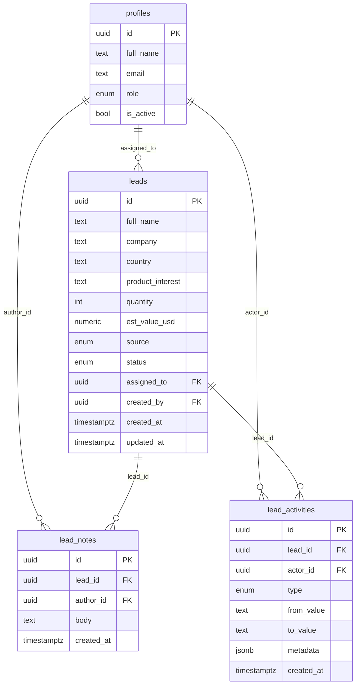

# Portside

**A lead desk for a B2B export/import sales team.** Enquiries arrive from a public form, land in a shared pipeline, get assigned to a salesperson, and carry a complete, automatically-written record of everything that happened to them.

[](https://github.com/Saba-Ahmad-sp/portside/actions/workflows/ci.yml)

> Built for the Digital Heroes Qualification Task Kit — **Role 04, Full Stack Development, Task A**.
> Task B is at [`docs/task-b-inherit-and-improve.md`](docs/task-b-inherit-and-improve.md).

**Live:** _see the submission link_
**Repo:** https://github.com/Saba-Ahmad-sp/portside

---

## Demo accounts

Password for all three: `PortsideDemo!2026`

| Role | Email | Why this one exists |
|---|---|---|
| **Admin** | `admin@portside.demo` | Sees every lead, assigns work, can open Team |
| **Member** | `priya@portside.demo` | Sees only leads assigned to her |
| **Member** | `rahul@portside.demo` | So you can verify isolation by hand — see below |

**Check the permission model yourself in 30 seconds:**

1. Sign in as **Priya**, open any lead, copy the URL
2. Sign out, sign in as **Rahul**, paste that URL
3. You get **404** — not "forbidden", not a redirect

A second admin (`dev@portside.demo`) also exists in the seed. Two admins is deliberate: with only one, you couldn't tell whether the check is `role === 'admin'` or a hardcoded owner id.

---

## What it does

| Requirement | Where |
|---|---|
| Public capture form | `/` → `POST /api/public/leads` |
| Authenticated app, two roles | Supabase Auth · `profiles.role` enum |
| Permissions enforced client **and** server | One shared `can()`, plus RLS — see [Authorisation](#authorisation) |
| Status pipeline | Ordered stages with a visual stepper on the lead detail |
| Assignment to a user | `PATCH /api/leads/:id/assignment`, admin only |
| Notes with timestamps | Append-only, shown as relative + absolute time |
| Activity trail | Written server-side on every change; no client can write to it |
| JSON API with pagination, filtering, status codes | 10 endpoints, [documented below](#api) |
| Automated tests | **80 tests** — 29 unit, 37 integration, 14 browser |
| Deployment on a free tier | Vercel + Supabase |

---

## Architecture

```
 Server Component ─────┐
                       ├──→  LeadService  ──→  LeadRepository  ──→  PostgreSQL
 Route Handler /api ───┘           │
                                   └──→  ActivityService

 Browser ── fetch ──→ /api/* ──→ Route Handler
```

**The service layer is the only place business rules and authorisation live.** Server Components call it directly; route handlers call the same functions and add nothing but HTTP. Neither path can skip a check, because there is no other route to the repository.

Three consequences worth stating:

**Route handlers are ~15 lines.** They parse, delegate, and return. That is the deliberate inverse of Task B's complaint about "business logic inside route handlers" — the two submissions argue the same thesis.

**Server Components do not fetch their own API.** An internal HTTP hop would be a wasted round trip and would lose request context. The route handlers exist as a *second doorway* into the same service — for API clients, for the test suite, and for you with `curl`.

**The browser never queries the database.** It uses Supabase for authentication only; all application data goes through `/api/*`. Task B of this same brief names "direct database calls from the frontend" as a defect, so doing it here would be incoherent.

### Layout

```
src/
├─ app/
│  ├─ (public)/page.tsx            landing + capture form
│  ├─ (auth)/login/page.tsx
│  ├─ (app)/                       dashboard · leads · leads/[id] · team
│  └─ api/                         10 route handlers
├─ components/                     leads/ · layout/ · shared/ · public/ · ui/
├─ lib/
│  ├─ permissions.ts               ★ PURE — shared by client and server
│  ├─ api/                         client.ts · responses.ts · route-helpers.ts
│  ├─ schemas/lead.ts              Zod, used on both sides
│  ├─ hooks/                       TanStack Query
│  └─ server/                      every file starts `import "server-only"`
│     ├─ dal.ts                    session resolution
│     ├─ lead-service.ts           authorisation + business rules
│     ├─ lead-repository.ts        queries only
│     └─ activity-service.ts       audit trail, service role
└─ proxy.ts                        redirect UX only — not a security boundary
supabase/migrations/               the schema IS these files
tests/                             unit · integration · e2e
```

`src/lib/permissions.ts` has **no imports at all**. That is what allows a client component to import it to hide a button and the service layer to import it to enforce the same rule — one function, so the two cannot drift apart.

---

## Authorisation

Three independent layers. Removing any one would not open the other two.

| Layer | What it does | Where |
|---|---|---|
| **1. UI** | Hides actions you cannot perform | `can()` in components |
| **2. Service** | Re-checks before every operation | `lead-service.ts` ← **the real boundary** |
| **3. Database** | Rejects unauthorised rows | RLS policies + table grants |

Hiding a button is courtesy, not security. Layer 2 is what the tests assert against.

### Permission matrix

| Action | Admin | Member |
|---|---|---|
| View all leads | ✅ | ❌ only leads assigned to them |
| View a specific lead | ✅ | ✅ only if assigned to them |
| Create a lead in-app | ✅ | ✅ |
| Change status | ✅ any | ✅ own only |
| Reopen a won/lost lead | ✅ | ❌ → `409` |
| Assign / reassign | ✅ | ❌ → `403` |
| Add a note | ✅ any | ✅ own only |
| View activity trail | ✅ any | ✅ own only |
| View team | ✅ | ❌ → `403` |
| Delete a lead | ❌ *not implemented — see Assumptions* | ❌ |

### `403` vs `404` — deliberate

> **`404`** — the record does not exist, **or you are not allowed to know that it does**
> **`403`** — you can see it, but this particular action is denied

A member requesting another member's lead gets **404**. Returning `403` would confirm the record exists, turning sequential ids into an enumeration oracle. A member trying to *assign* a lead they can already see gets **403**, because there is nothing left to hide.

This falls out structurally rather than by convention: Row Level Security returns nothing, the repository returns `null`, the service raises 404. Asserted in `tests/integration/auth-rules.test.ts`.

### Why `proxy.ts` is not the boundary

`proxy.ts` (Next.js 16's rename of `middleware.ts`) refreshes the session cookie and redirects for UX. It authorises nothing. The Next.js docs warn that *"a matcher change or a refactor that moves a Server Function to a different route can silently remove Proxy coverage"* — so every page and route handler re-verifies through the DAL, next to the data. Deleting `proxy.ts` would cost a redirect, not a security boundary.

Auth checks are likewise **not** in a layout: layouts do not re-render on navigation under partial rendering.

---

## Data model



Pipeline: `new → contacted → qualified → proposal → won`, with `lost` as an exit at any point.

### Modelling decisions

**Status is a Postgres `enum`, not text.** An invalid status is rejected by the database, not only by the form. Validation belongs at the lowest layer that can express it.

**Activities are their own table, not a `jsonb` column on `leads`.** They need independent pagination, per-actor querying and their own index. A JSON blob supports none of that.

**`actor_id` and `created_by` are nullable.** A lead from the public form has no logged-in actor — that activity row honestly reads *"Lead created from the public enquiry form"* rather than attributing it to a staff member.

**`assigned_to` is `ON DELETE SET NULL`; notes and activities `CASCADE`.** Deactivating a salesperson must not delete the leads they touched. Deleting a lead should not orphan its notes.

**No delete path for leads.** No endpoint, no RLS policy, and no `DELETE` grant. A CRM that hard-deletes leads destroys its own audit trail and its reporting; admins mark a lead `lost` instead.

**Every column referenced by an RLS policy is indexed.** Supabase documents >100× improvements from this.

### Row Level Security

```sql
create policy "leads: admins read all, members read assigned"
on public.leads for select to authenticated
using ( (select private.is_admin()) or assigned_to = (select auth.uid()) );
```

Applied throughout, all measured practices:

- **`(select auth.uid())`, never bare `auth.uid()`** — the subselect becomes an initPlan evaluated once per statement instead of once per row (179 ms → 9 ms in Supabase's benchmark)
- **`TO authenticated` on every policy** — anonymous sessions skip evaluation entirely
- **`private.is_admin()`** as a `SECURITY DEFINER` helper rather than joining `profiles` inside every policy (178,000 ms → 12 ms). It lives in a schema PostgREST does not expose, and pins `search_path = ''` to prevent search-path hijacking
- **`with check` written out explicitly** on update policies. PostgreSQL falls back to `using` when it is omitted, so this is not strictly required — it is there so the intended write constraint is legible without knowing that rule

**Two independent gates.** This project runs with Supabase's *"automatically expose new tables"* disabled, so privileges are granted explicitly in a migration. `GRANT` decides whether a role may touch a table at all; `POLICY` decides which rows. Both must agree.

Note what is absent: no `DELETE` on leads, no `UPDATE`/`DELETE` on notes, **no `INSERT` on `lead_activities` for any client role**. The audit trail is written only by the service role. An audit trail a user can write to is not an audit trail.

**Anonymous visitors have no database access at all.** The public form posts to `/api/public/leads`, which validates and writes server-side.

---

## API

Base: `/api`. Every response uses the same envelope.

```jsonc
{ "data": [ ], "meta": { "page": 1, "limit": 20, "total": 143, "totalPages": 8 } }
{ "data": { } }
{ "error": { "code": "FORBIDDEN", "message": "Only admins can assign leads." } }
```

A `422` additionally carries `error.fields`, a `field → messages` map ready to feed back into a form.

| Method | Endpoint | Auth | Success | Errors |
|---|---|---|---|---|
| `POST` | `/api/public/leads` | public | `201` | `400` `422` |
| `GET` | `/api/leads` | required | `200` | `400` `401` |
| `GET` | `/api/leads/:id` | required | `200` | `400` `401` `404` |
| `PATCH` | `/api/leads/:id` | required | `200` | `400` `401` `403` `404` `409` `422` |
| `GET` | `/api/leads/:id/notes` | required | `200` | `400` `401` `404` |
| `POST` | `/api/leads/:id/notes` | required | `201` | `400` `401` `403` `404` `422` |
| `GET` | `/api/leads/:id/activities` | required | `200` | `400` `401` `404` |
| `PATCH` | `/api/leads/:id/assignment` | **admin** | `200` | `400` `401` `403` `404` `422` |
| `GET` | `/api/members` | **admin** | `200` | `401` `403` |
| `GET` | `/api/health` | public | `200` | `503` |

### Status codes

| Code | Meaning here |
|---|---|
| `200` | Read or update succeeded |
| `201` | Resource created |
| `400` | Malformed request — bad UUID, unknown filter, `limit` over 100 |
| `401` | Not authenticated |
| `403` | Visible to you, but this action is denied |
| `404` | Does not exist, **or you may not know that it does** |
| `409` | Valid body, invalid state change (a member reopening a closed lead) |
| `422` | Body failed schema validation — includes per-field messages |

`429` is **not** documented because rate limiting is not implemented — see Assumptions.

### Query parameters — `GET /api/leads`

| Param | Values | Default |
|---|---|---|
| `page` | positive integer | `1` |
| `limit` | 1–100 | `20` |
| `status` | `new` `contacted` `qualified` `proposal` `won` `lost` | — |
| `assigneeId` | user id, or `unassigned` | — |
| `q` | matches name, company or email | — |
| `sort` | `created_at` `-created_at` `updated_at` `-updated_at` | `-created_at` |

These map 1:1 onto the UI's URL, so `/leads?status=won&q=trading` and `/api/leads?status=won&q=trading` take the same arguments. A filtered view is shareable, survives refresh, and works with the back button.

### Testing it with curl

The API accepts either a browser cookie session or an `Authorization: Bearer` header, so it is usable outside a browser. Get a token:

```bash
SUPABASE_URL="https://<your-project>.supabase.co"
ANON_KEY="<publishable key>"

TOKEN=$(curl -s -X POST "$SUPABASE_URL/auth/v1/token?grant_type=password" \
  -H "apikey: $ANON_KEY" -H "Content-Type: application/json" \
  -d '{"email":"admin@portside.demo","password":"PortsideDemo!2026"}' \
  | jq -r .access_token)
```

Then:

```bash
BASE="https://<deployed-url>"

# List, filter, search, sort, page
curl -s "$BASE/api/leads?status=qualified&q=trading&sort=-updated_at&limit=20" \
  -H "Authorization: Bearer $TOKEN"

# One lead
curl -s "$BASE/api/leads/<id>" -H "Authorization: Bearer $TOKEN"

# Move it along the pipeline
curl -s -X PATCH "$BASE/api/leads/<id>" \
  -H "Authorization: Bearer $TOKEN" -H "Content-Type: application/json" \
  -d '{"status":"qualified"}'

# Assign it (admin only)
curl -s -X PATCH "$BASE/api/leads/<id>/assignment" \
  -H "Authorization: Bearer $TOKEN" -H "Content-Type: application/json" \
  -d '{"assigneeId":"<user-id>"}'

# Add a note
curl -s -X POST "$BASE/api/leads/<id>/notes" \
  -H "Authorization: Bearer $TOKEN" -H "Content-Type: application/json" \
  -d '{"body":"Called the buyer, pricing sent."}'

# The trail
curl -s "$BASE/api/leads/<id>/activities" -H "Authorization: Bearer $TOKEN"

# Public capture — no auth
curl -s -X POST "$BASE/api/public/leads" -H "Content-Type: application/json" \
  -d '{"fullName":"Amara Okafor","email":"amara@westbridge.co.uk",
       "company":"Westbridge Foods","country":"United Kingdom",
       "message":"Sourcing basmati for a UK private label."}'
```

**Try the permission rules.** Get a token for `priya@portside.demo` and repeat the assignment call — `403`. Get one for `rahul@portside.demo` and request one of Priya's leads — `404`.

---

## Tests

```bash
npm run test          # unit + integration   (66)
npm run test:e2e      # browser              (14)
```

| Tier | Count | What it proves |
|---|---|---|
| **Unit** — `tests/unit` | 29 | `can()` and `canTransition()` over every role × action × ownership combination, plus fail-closed cases: no user, deactivated account, missing lead. Pure functions, 0.4s |
| **Integration** — `tests/integration` | 37 | Real HTTP, real sessions, real database. Auth rules and both core flows end to end |
| **Browser** — `tests/e2e` | 14 | A person can do the job, and the UI agrees with the API about who may do what |

**Nothing is mocked in the integration tier**, deliberately. What is being verified is that the service layer *and* Row Level Security agree — a mocked database would only prove the service agrees with itself. It authenticates with `Authorization: Bearer`, the same path an external client takes, so the suite passing is itself evidence the API works outside a browser.

Highlights worth reading:

- A crafted `POST` to the public endpoint cannot create a lead that is already won or already assigned
- An invisible lead answers `404`; a visible-but-forbidden action answers `403`
- A member reopening a closed lead gets `409` — valid body, refused transition
- The activity trail contains exactly the right four entries, in order, without anyone writing them

---

## Running it locally

**Requires** Node 20.9+ (built on 24) and a free Supabase project.

```bash
git clone https://github.com/Saba-Ahmad-sp/portside.git
cd portside
npm install
cp .env.example .env.local     # then fill in your Supabase values
```

Create a Supabase project with **"Automatically expose new tables" OFF** and **"Enable automatic RLS" ON**, then run the migrations in order in the SQL Editor:

```
supabase/migrations/0001_schema.sql
supabase/migrations/0002_functions.sql
supabase/migrations/0003_rls.sql
```

`supabase/RUN-THIS-IN-SUPABASE.sql` is the three concatenated, if you would rather paste once.

```bash
npm run seed     # 5 users, 35 leads, 138 activities, 11 notes
npm run dev
```

| Script | |
|---|---|
| `npm run dev` | Development server |
| `npm run build` | Production build |
| `npm run typecheck` | `tsc --noEmit` |
| `npm run lint` | `eslint .` — note `next lint` was removed in Next.js 16 |
| `npm run test` | Vitest |
| `npm run test:e2e` | Playwright |
| `npm run seed` | Reset and reseed demo data |

---

## Stack

| | |
|---|---|
| **Framework** | Next.js 16.2 (App Router), React 19.2, TypeScript strict |
| **UI** | Tailwind CSS 4.3, shadcn/ui, lucide-react, motion |
| **Forms & validation** | React Hook Form + Zod 4 — the same schema on both sides |
| **Server state** | TanStack Query v5, in interactive panels only |
| **Backend** | Next.js Route Handlers → service → repository |
| **Database** | Supabase PostgreSQL with RLS |
| **Auth** | Supabase Auth (email + password) |
| **Tests** | Vitest, Playwright |
| **CI/CD** | GitHub Actions (CI) · Vercel (CD) |

### Considered and rejected

| Rejected | Why |
|---|---|
| Django/DRF, Express, NestJS | A second deployment, duplicated types across the network boundary, and no marks for it. The brief asks for *one coherent product* |
| MongoDB, Firebase | Leads → notes → activities → users is relational. Data modelling is the highest-weighted criterion |
| TanStack DB | v0.6.x, still beta — and despite the name it is a client-side store, not a database |
| Edge runtime | Next.js 16 moves away from it; `proxy.ts` is Node-only by design |
| Redux Toolkit | URL state plus TanStack Query covers it. Zustand ended up unnecessary too |
| `cacheComponents` | Every authenticated page is per-user data. Caching it would be a security bug, not an optimisation |
| React Compiler | Adds Babel to the build for no measurable benefit at this size |
| Kanban board, bulk actions | Not required. Hours of work, zero marks |

---

## Assumptions

The brief says assumptions are part of the test. These are mine.

1. **Single organisation.** One company, many admins and members. Multi-tenancy would add `organization_id` to every table and a tenant predicate to every RLS policy — deliberately out of scope for the timeline.
2. **Leads are never deleted.** Product judgement, not an omission: hard-deleting leads destroys the activity trail and the reporting built on it. Admins mark a lead `lost`. There is no endpoint, no policy and no grant for it.
3. **Email + password auth**, so a reviewer can sign in without a mailbox. Magic links or OAuth would be the real choice.
4. **No rate limiting**, so `429` is not documented. In-memory counters do not work across serverless instances; doing it properly needs Redis or a database-backed throttle. The public form does carry a honeypot.
5. **Role management is out of scope.** Accounts come from the seed. A real implementation would need a guard preventing demotion of the last remaining admin.
6. **Activity writes are best-effort.** A failed audit write is logged, not thrown — losing an audit row is bad, but failing a salesperson's status update because the audit write timed out is worse. Production would use a durable queue.
7. **The seeded data is fictional.** No real company, contact or email address.
8. **The demo password is published on purpose.** A reviewer needs to get in. It is not how real accounts would be provisioned.

---

## Where AI was used

I used Claude Code throughout, and directed it rather than accepted its output. The architecture, the aesthetic direction, and every consequential decision were mine; the model wrote a lot of the code and I corrected it where it was wrong.

Concretely, things I changed or overruled: it initially proposed a single shared permissions module marked `server-only`, which cannot be imported by a client component — the split into a pure `permissions.ts` plus a `server-only` DAL is the corrected design. It suggested returning `403` for leads a member cannot see; I chose `404` for the enumeration reason documented above. It claimed an RLS `UPDATE` policy without `WITH CHECK` allows writing a row out of scope — I checked the PostgreSQL documentation, found that `USING` is used for both when `WITH CHECK` is omitted, and kept the explicit form for readability rather than for correctness. It also missed that `service_role` needs explicit table grants when *"expose new tables"* is disabled, which only surfaced as a failing seed run.

I used it to move faster on things I already understand — schema, route handlers, test scaffolding — and to pressure-test things I wanted a second opinion on. Every version number in this repo was verified against the npm registry rather than taken from the model's memory, and the Next.js 16 and Supabase RLS claims were checked against their official documentation.

---

## Not built, and why

Rate limiting · in-app user invitation · bulk actions · Kanban board · email notifications · lead-to-order conversion · multi-tenancy.

The natural next step is converting a **Won** lead into an order, which is where a products table would earn its place. It would not have earned it here.

---

<sub>Built for Digital Heroes Training Task — https://digitalheroesco.com</sub>
