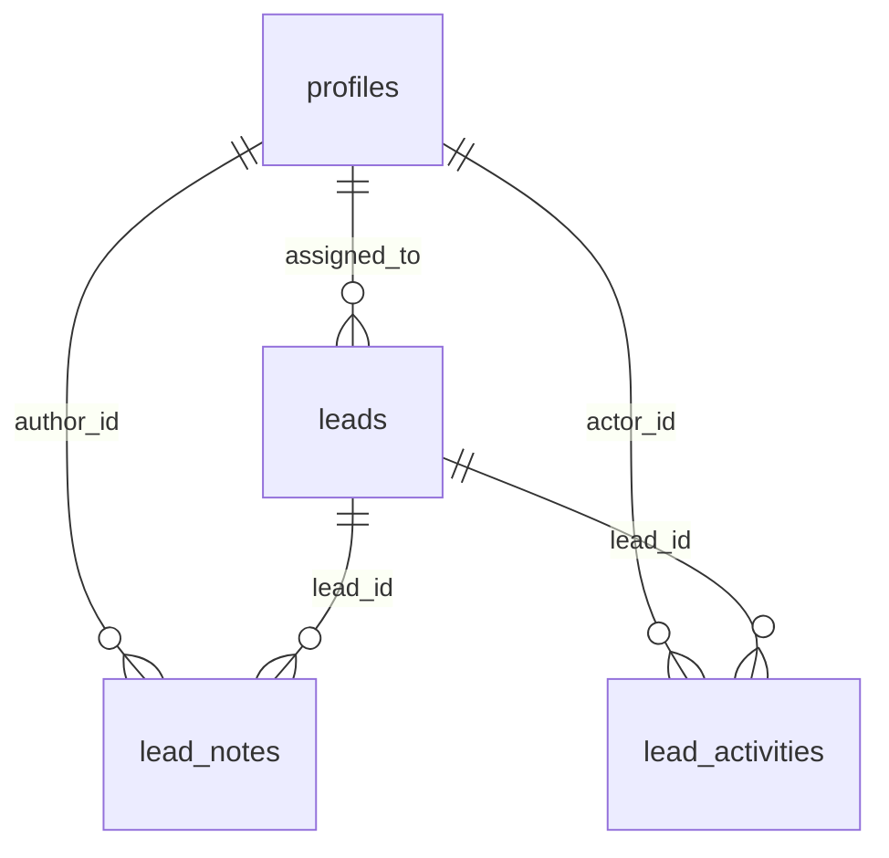

# Portside — Build Plan

**Submission:** Digital Heroes Qualification Task Kit — **Role 04 / 16, Full Stack Development**
**Candidate:** Saba Ahmad
**Brief received:** 24 July 2026 (evening) · **Target submit:** 26 July 2026
**Repo:** public GitHub · **Deploy:** Vercel + Supabase (free tiers)

> Portside is a lead desk for a B2B export–import trading firm. Enquiries arrive from a
> public website form, land in a shared pipeline, get assigned to a salesperson, and carry a
> complete, automatically-written history of everything that happened to them.

---

## 0. Ground rules from the kit

These are submission rules, not task requirements. Missing one is a hard fail.

- [ ] Complete **both** Task A and Task B — one role only
- [ ] Google Drive folder named `Role04_Saba Ahmad`, set to **anyone with the link can view**
- [ ] Submit by **Instagram DM to @realshreyanshsingh** — follow the account *before* sending
- [ ] **Send links, not files** — Drive index doc listing: live URL, repo URL, credentials, Task B
- [ ] Footer on every page: `Built for Digital Heroes Training Task` → https://digitalheroesco.com
- [ ] README contains a paragraph on **where AI was used and what was changed afterwards**
- [ ] README contains an **Assumptions** section — "assumptions are part of the test"
- [ ] GitHub repo is **public**

---

## 1. Requirement → implementation map

Every clause of Role 04 Task A, mapped to where it is satisfied.

| Brief clause | Implementation |
|---|---|
| "Public capture form" | `/` landing page → `POST /api/public/leads` |
| "authenticated application" | Supabase Auth, email + password, `/login` |
| "at least two roles — admin and member" | `profiles.role` enum. Seed: 2 admins, 3 members |
| "enforced permissions on **client**" | Nav items, action buttons and `/team` route all gated by `can()` |
| "enforced permissions on **server**" | Service layer calls `can()` before every operation; RLS underneath |
| "status pipeline" | Ordered enum + visual stepper on lead detail |
| "assignment to a user" | `PATCH /api/leads/:id/assignment`, admin-only |
| "notes with timestamps" | `lead_notes.created_at`, **displayed** as relative + absolute time |
| "an activity trail" | `lead_activities`, written server-side only, never client-supplied |
| "JSON API for leads" | 8 Route Handlers under `app/api/` |
| "pagination" | `?page=&limit=` + `meta: { page, limit, total, totalPages }` |
| "filtering" | `?status=&assigneeId=&q=` |
| "proper status codes" | Documented table below; only codes actually returned are documented |
| "documented in the README" | API contract **inline in README.md**, not a separate file |
| "tests covering auth rules" | Permission truth table + 401/403/404 API tests |
| "at least two core flows" | Four flows covered (see §9) |
| "deployment on any free tier" | Vercel + Supabase |
| "credentials for each role" | Three logins published (admin + two members) |

### Scoring weights — where the effort goes

| Criterion | Weight | Our answer |
|---|---|---|
| Architecture and data modeling | **30** | Layered architecture, enums/FKs/indexes, ERD + written rationale |
| Auth and permission correctness | **25** | Three enforcement layers, one shared policy, 401/403/404 discipline |
| API design and documentation | **20** | Consistent envelope, honest status codes, curl-able docs |
| Test coverage and deployment | **25** | Vitest + Playwright + CI badge + live URL |

---

## 2. Assumptions (goes in the README verbatim)

1. **Single organisation.** One company, many admins and members. Multi-tenancy would add
   `organization_id` to every table and a tenant predicate to every RLS policy — deliberately
   out of scope for this timeline.
2. **Email + password auth.** No OAuth, no magic links — keeps reviewer sign-in trivial.
3. **Leads are never deleted.** A CRM that hard-deletes leads destroys its own activity trail
   and reporting. Admins mark a lead `lost` instead. No `DELETE` endpoint by design.
4. **No email notifications.** Out of scope; would be a queued side-effect of the activity service.
5. **Role management is out of scope.** If added it would need a guard preventing demotion of
   the last remaining admin.
6. **Seed data is fictional.** Export–import domain chosen because it is the domain I work in.

---

## 3. Tech stack

### Frontend

| Package | Purpose |
|---|---|
| `next` 16 (App Router) | Framework, routing, Server Components, API layer |
| `react` / `react-dom` 19 | UI |
| `typescript` (strict) | Types shared across the client/server boundary |
| `tailwindcss` 4 | Styling |
| `shadcn/ui` | Components — copied into the repo, we own the code |
| `lucide-react` | Icons |
| `react-hook-form` + `@hookform/resolvers` v5 | Forms |
| `zod` 4 | Validation — **the same schema runs in browser and server** |
| `@tanstack/react-query` v5 | Server state, **interactive areas only** |
| `motion` | Animation — dialogs, status feedback, activity stagger |
| `sonner` | Toasts |
| `date-fns` | Relative timestamps |
| URL search params | Filters + pagination state — no library |
| `zustand` | Optional. Only if a genuine shared UI state appears. Likely unused. |

### Backend — inside the same Next.js project

| Layer | Location | Responsibility |
|---|---|---|
| Route Handlers | `src/app/api/**/route.ts` | HTTP only: parse, validate, status codes. ~15 lines each |
| Service | `src/lib/server/lead-service.ts` | Business rules, authorization, writes activity trail |
| Repository | `src/lib/server/lead-repository.ts` | Database queries. Nothing else |
| DAL | `src/lib/server/dal.ts` | Session resolution. `import 'server-only'` + React `cache()` |
| Policy | `src/lib/permissions.ts` | **Pure** `can()`. No imports. Shared with client |
| Responses | `src/lib/api/responses.ts` | `ok()` `created()` `forbidden()` `notFound()` |
| Schemas | `src/lib/schemas/lead.ts` | Zod |
| Supabase clients | `src/lib/server/supabase/` | `server.ts`, `admin.ts` |
| `proxy.ts` | project root | Redirect UX **only** — never the security boundary |

### Database

Supabase PostgreSQL. Tables `profiles`, `leads`, `lead_notes`, `lead_activities`.
Postgres enums, foreign keys, indexes, triggers, RLS.

### Quality & deployment

`vitest` · `@playwright/test` · ESLint flat config · GitHub Actions (CI) · Vercel (CD).

### Deliberately rejected — document in README

| Rejected | Why |
|---|---|
| Django / DRF, Express, NestJS | Second deployment, duplicated types, no marks for it. The brief asks for *one coherent product* |
| MongoDB, Firebase | Leads → notes → activities → users is relational. Data modeling is the 30% criterion |
| TanStack DB | v0.6.x beta, and it is a client store, not a database |
| Edge runtime | Next 16 moves away from it; `proxy.ts` is Node-only |
| Redux Toolkit | Query + URL state covers it |
| `cacheComponents` | Every authenticated page is per-user data. Caching it would be a security bug |
| React Compiler | Adds Babel to the build; risk without measurable benefit here |
| Kanban board, bulk actions | Not required. Cost hours, earn nothing |

---

## 4. Architecture

```
 Server Component ─────┐
                       ├──→ LeadService ──→ LeadRepository ──→ PostgreSQL
 Route Handler /api ───┘          │
                                  └──→ ActivityService

 Client UI ── fetch ──→ /api/* ──→ Route Handler
```

**The rule:** the service layer is the *only* place business rules and authorization live.
Server Components call it directly (no internal HTTP hop). Route Handlers are a second doorway
into the same service, for API clients, tests, and the reviewer's curl. Neither duplicates a rule.

**The browser never queries the database.** It uses Supabase only for login/session; all
application data goes through `/api/*`. This is deliberate — Task B of this same brief names
"direct database calls from the frontend" as a defect, and the two tasks must argue the same thesis.

### Three enforcement layers

1. **UI** — `can()` hides unavailable actions and guards admin-only routes
2. **Server** — the service re-checks `can()` before every operation, independent of the UI
3. **Database** — RLS policies reject unauthorized rows even if layers 1 and 2 were bypassed

Hiding a button is never security. Layer 2 is the real boundary; layer 3 is the safety net.

---

## 5. Folder structure

```
portside/
├─ .github/workflows/
│  ├─ ci.yml                          # typecheck → lint → vitest → playwright
│  └─ keepalive.yml                   # daily cron → /api/health
├─ supabase/migrations/
│  ├─ 0001_schema.sql                 # enums, tables, FKs, indexes
│  ├─ 0002_functions.sql              # private.is_admin(), triggers
│  ├─ 0003_rls.sql                    # policies
│  └─ 0004_seed.sql                   # 2 admins, 3 members, ~35 leads
├─ src/
│  ├─ app/
│  │  ├─ (public)/page.tsx            # landing + capture form
│  │  ├─ (auth)/login/page.tsx
│  │  ├─ (dashboard)/
│  │  │  ├─ layout.tsx
│  │  │  ├─ dashboard/page.tsx        # summary cards
│  │  │  ├─ leads/page.tsx            # table, filters, pagination
│  │  │  ├─ leads/[id]/page.tsx       # detail, stepper, notes, activity
│  │  │  └─ team/page.tsx             # admin-only, read-only
│  │  └─ api/
│  │     ├─ public/leads/route.ts
│  │     ├─ leads/route.ts
│  │     ├─ leads/[id]/route.ts
│  │     ├─ leads/[id]/notes/route.ts
│  │     ├─ leads/[id]/assignment/route.ts
│  │     ├─ leads/[id]/activities/route.ts
│  │     ├─ members/route.ts
│  │     └─ health/route.ts
│  ├─ components/{ui,leads,layout}/
│  ├─ lib/
│  │  ├─ permissions.ts               # PURE — safe on both sides
│  │  ├─ api/responses.ts
│  │  ├─ schemas/lead.ts
│  │  └─ server/                      # every file starts: import 'server-only'
│  │     ├─ dal.ts
│  │     ├─ lead-service.ts
│  │     ├─ lead-repository.ts
│  │     ├─ activity-service.ts
│  │     └─ supabase/{server,admin}.ts
│  └─ proxy.ts
├─ tests/
│  ├─ unit/permissions.test.ts
│  ├─ integration/leads-api.test.ts
│  └─ e2e/*.spec.ts
├─ docs/task-b-inherit-and-improve.md
├─ .env.example
├─ plan.md
└─ README.md
```

**`src/lib/permissions.ts` must stay pure** — no database code, no `process.env`, no server
imports, no `server-only`. It accepts a minimal, safe object:

```ts
type PermissionUser = { id: string; role: 'admin' | 'member'; isActive: boolean }
```

That is why it can be imported by both a client component (to hide a button) and the service
layer (to enforce). One function, no drift.

---

## 6. Data model



```
profiles
  id            uuid PK → auth.users.id
  full_name     text
  email         text
  role          user_role   ('admin' | 'member')
  is_active     boolean default true
  created_at    timestamptz

leads
  id                uuid PK
  full_name         text not null
  email             text not null
  phone             text
  company           text not null
  country           text not null
  product_interest  text
  quantity          integer
  est_value_usd     numeric
  message           text
  source            lead_source  ('website' | 'manual' | 'referral')
  status            lead_status  default 'new'
  assigned_to       uuid → profiles(id) on delete set null
  created_by        uuid → profiles(id) nullable   -- null for public submissions
  created_at        timestamptz
  updated_at        timestamptz   -- maintained by trigger

lead_notes
  id          uuid PK
  lead_id     uuid → leads(id) on delete cascade
  author_id   uuid → profiles(id)
  body        text not null
  created_at  timestamptz

lead_activities
  id          uuid PK
  lead_id     uuid → leads(id) on delete cascade
  actor_id    uuid → profiles(id) nullable   -- null = system / public form
  type        activity_type
  from_value  text
  to_value    text
  metadata    jsonb
  created_at  timestamptz
```

### Enums

```sql
user_role     : admin | member
lead_source   : website | manual | referral
lead_status   : new | contacted | qualified | proposal | won | lost
activity_type : lead_created | assigned | unassigned | status_changed | note_added
```

### Indexes

```sql
create index leads_assigned_to_idx     on leads (assigned_to);
create index leads_status_idx          on leads (status);
create index leads_created_at_idx      on leads (created_at desc);
create index leads_assigned_status_idx on leads (assigned_to, status);
create index lead_notes_lead_id_idx      on lead_notes (lead_id);
create index lead_activities_lead_id_idx on lead_activities (lead_id, created_at desc);
```

### Data-model rationale — goes in the README

- **Status is a Postgres enum, not text** — an invalid status is rejected by the database, not
  only by the form. Validation at the lowest possible layer.
- **Activities are a table, not a `jsonb` column on `leads`** — they need independent
  pagination, per-actor querying, and their own index. A JSON blob cannot be queried or indexed
  the same way.
- **`actor_id` is nullable** — a lead created by the public form has no logged-in actor. That
  activity row reads *"Lead created from website form."*
- **`assigned_to` is `on delete set null`, notes/activities are `cascade`** — deactivating a
  salesperson must not delete the leads they touched, but deleting a lead should not orphan
  its notes.
- **Indexes on every RLS-policy column** — Supabase documents >100× improvements from this.
- **No `deleted_at`** — leads are retained by design (see Assumptions).

---

## 7. Permission model

| Action | Admin | Member |
|---|---|---|
| View all leads | ✅ | ❌ — only leads assigned to them |
| View a specific lead | ✅ | ✅ only if assigned to them |
| Create lead (public form) | n/a — unauthenticated | n/a |
| Create lead (in app) | ✅ | ✅ |
| Change status | ✅ any | ✅ own only |
| Assign / reassign | ✅ | ❌ |
| Add note | ✅ any | ✅ own only |
| View activity trail | ✅ any | ✅ own only |
| View team / members | ✅ | ❌ |
| Delete lead | ❌ *not implemented by design* | ❌ |

### Status code discipline

| Situation | Code |
|---|---|
| Read / update succeeded | `200` |
| Resource created | `201` |
| Malformed request or query params | `400` |
| Not authenticated | `401` |
| **Visible to you, but this action is denied** | `403` |
| **Does not exist, OR you are not allowed to know it exists** | `404` |
| Body fails schema validation | `422` |

**The 403/404 rule is deliberate and must be stated in the README.** Returning `403` for a lead
a member cannot see would confirm the record exists — an enumeration oracle. A member requesting
another member's lead gets `404`; a member attempting to assign a lead they *can* see gets `403`.

> `409` and `429` are documented **only if implemented.** A shorter honest contract beats a
> longer aspirational one.

---

## 8. RLS design

```sql
-- Helper lives in a schema that is NOT exposed through the API.
create schema if not exists private;

create or replace function private.is_admin()
returns boolean
language sql
security definer
set search_path = ''        -- mandatory: prevents search_path hijacking
stable
as $$
  select exists (
    select 1 from public.profiles
    where id = (select auth.uid()) and role = 'admin' and is_active
  );
$$;

revoke all on function private.is_admin() from anon, authenticated;
```

Every policy follows the same shape:

```sql
create policy "members read assigned leads"
on public.leads for select to authenticated
using ( (select private.is_admin()) or assigned_to = (select auth.uid()) );

create policy "members update assigned leads"
on public.leads for update to authenticated
using      ( (select private.is_admin()) or assigned_to = (select auth.uid()) )
with check ( (select private.is_admin()) or assigned_to = (select auth.uid()) );

create policy "public can submit leads"
on public.leads for insert to anon
with check ( source = 'website' and assigned_to is null and status = 'new' );
```

**Rules being followed, all measured by Supabase:**

- `(select auth.uid())` never bare `auth.uid()` — triggers an initPlan that caches the result
  instead of re-evaluating per row (179 ms → 9 ms in Supabase's benchmark)
- `TO authenticated` on every policy — skips evaluation for anon entirely
- `SECURITY DEFINER` helper instead of joining `profiles` inside each policy (178,000 ms → 12 ms)
- Indexes on every column referenced in a policy
- **`with check` written explicitly** even though Postgres falls back to `using` when it is
  omitted — being explicit makes the intended rule legible to a reviewer
- The anon insert policy is **narrow**: it can only create `website`-source, unassigned, `new`
  leads. It cannot read anything.

**Migrations are the source of truth.** Schema, policies, functions and indexes live in
`supabase/migrations/`. Supabase Studio is for inspecting and debugging only — never for
changing things, or the repo stops describing production.

**Studio bypasses RLS.** It runs with a privileged Postgres role, so it can never be used to
verify that policies work. Verify through the app and the test suite.

---

## 9. API contract

Base: `/api`. Documented **inline in README.md** with a runnable curl example per endpoint.

| Method | Endpoint | Auth | Success | Errors |
|---|---|---|---|---|
| `POST` | `/api/public/leads` | public | `201` | `400`, `422` |
| `GET` | `/api/leads` | required | `200` | `400`, `401` |
| `GET` | `/api/leads/:id` | required | `200` | `401`, `404` |
| `PATCH` | `/api/leads/:id` | required | `200` | `401`, `403`, `404`, `422` |
| `POST` | `/api/leads/:id/notes` | required | `201` | `401`, `403`, `404`, `422` |
| `GET` | `/api/leads/:id/activities` | required | `200` | `401`, `404` |
| `PATCH` | `/api/leads/:id/assignment` | **admin** | `200` | `401`, `403`, `404`, `422` |
| `GET` | `/api/members` | **admin** | `200` | `401`, `403` |
| `GET` | `/api/health` | public | `200` | — |

**Query parameters** on `GET /api/leads`:
`page` (default 1) · `limit` (default 20, max 100) · `status` · `assigneeId` · `q` (name/company/email) · `sort` (`-created_at` default)

**Response envelope — identical everywhere:**

```jsonc
// list
{ "data": [ /* … */ ],
  "meta": { "page": 1, "limit": 20, "total": 143, "totalPages": 8 } }

// single
{ "data": { /* … */ } }

// error
{ "error": { "code": "FORBIDDEN", "message": "Only admins can assign leads." } }
```

**Session resolution accepts two sources** so the API is testable outside a browser:

1. `Authorization: Bearer <supabase_access_token>` — for curl / Postman / any API client
2. Supabase cookie session — for the app itself

The README documents how to obtain a token. **No real token is ever published in the repo.**

---

## 10. Testing plan

### Vitest — unit

`tests/unit/permissions.test.ts` — a truth table over every
`role × action × ownership` combination against the pure `can()` function. No I/O, runs in
milliseconds, and exhaustively proves the permission matrix. Highest marks-per-minute in the task.

### Vitest — integration (API level)

1. Unauthenticated `GET /api/leads` → `401`
2. Member `PATCH /api/leads/:id/assignment` → `403`
3. Member `GET` a lead assigned to someone else → `404` (not 403 — no existence leak)
4. Member `GET /api/members` → `403`
5. `POST /api/public/leads` with a bad body → `422`
6. Pagination returns correct `meta.total` and `meta.totalPages`

### Playwright — end-to-end

1. **Public capture** — submit the form → lead exists with status `new` → activity trail reads
   "Lead created from website form"
2. **Admin assignment** — admin logs in, assigns a lead to Priya → activity records the assignment
3. **Member follow-up** — Priya logs in, sees the lead, changes status, adds a note → trail shows
   three entries in order
4. **Isolation** — Rahul logs in and opens the URL of one of Priya's leads → denied

Login once per role in `globalSetup`, reuse `storageState`. No `waitForTimeout`. `getByRole`
selectors so the tests double as an accessibility check.

---

## 11. CI/CD

**GitHub Actions = CI.** Vercel's Git integration already handles CD (push to `main` → production,
PR → preview). Do not write a deploy job.

```yaml
# .github/workflows/ci.yml  — on push + pull_request
- actions/checkout@v4
- actions/setup-node@v4        # node 22, cache: npm
- npm ci
- npm run typecheck            # tsc --noEmit
- npm run lint                 # eslint .   ← `next lint` was REMOVED in Next 16
- npm run test                 # vitest run
- npx playwright install --with-deps chromium
- npm run test:e2e
```

A second workflow (`keepalive.yml`) runs a daily cron against `/api/health`.

> **Why this matters:** Supabase pauses free projects after ~7 days of inactivity. The kit says
> reviews take time and that broken links count as no submission. Ten lines of YAML prevent a
> dead demo. Caveat: GitHub disables scheduled workflows in public repos after 60 days of no
> repository activity — well beyond the review window here.

**Next.js 16 gotchas that will bite on day one:**

- `middleware.ts` → **`proxy.ts`**, exported function renamed to `proxy`
- `params`, `searchParams`, `cookies()`, `headers()` are all **async** — `await` every one
- `next lint` is **removed** and `next build` no longer lints — wire ESLint yourself or get nothing
- Node 20.9+ / TypeScript 5.1+ minimums

---

## 12. Timeline

### Tier 1 — must ship

**Day 1 (25 Jul)**
1. Supabase project + `0001`–`0004` migrations: enums, tables, FKs, indexes, RLS, seed
2. Seed: 2 admins, 3 members, ~35 leads across all statuses
3. `lib/permissions.ts` · `lib/server/dal.ts` · service · repository · `lib/api/responses.ts`
4. All Route Handlers with Zod validation and the documented envelope
5. Public capture form → lead + activity row
6. `/leads` list (filters, pagination) · `/leads/[id]` (status, assignment, notes, activity)

**Day 2 (26 Jul) — morning**
7. Vitest: permission truth table, API auth tests, pagination assertion
8. Playwright: four flows
9. `/team` page · status stepper · Bearer-token support in the DAL

**Day 2 — afternoon**
10. README: inline API docs, ERD, data-model rationale, permission table, 403/404 rule,
    assumptions, AI-use paragraph, credentials
11. Deploy to Vercel, shared footer with the Digital Heroes credit, verify production end-to-end
12. GitHub Actions CI + keep-alive cron

**Day 2 — evening (protect this block)**
13. **Task B** — 3–4 hours. Separate 100 points.
14. Loom walkthrough, Drive folder, Instagram DM

### Tier 2 — only if Tier 1 is complete

`/dashboard` aggregate cards · in-app member invite · `409` terminal-status guard ·
rate limiting on the public form (and only then document `429`)

### Not building

Kanban board · bulk actions · multi-tenancy · role management UI · email notifications ·
React Compiler · Cache Components

---

## 13. README checklist

- [ ] Project summary + live URL + CI badge
- [ ] **Demo credentials — three logins**

  | Role | Email | Purpose |
  |---|---|---|
  | Admin | `admin@portside.demo` | Sees all leads, can assign, can open `/team` |
  | Member | `priya@portside.demo` | Sees only her leads |
  | Member | `rahul@portside.demo` | Lets the reviewer verify isolation by hand |

  *(A second admin exists in the seed to demonstrate that admin is a role, not a hardcoded owner.)*
- [ ] Architecture diagram + the three-enforcement-layers paragraph
- [ ] **Mermaid ERD** + data-model rationale
- [ ] Permission matrix table
- [ ] **Full API contract inline** — every endpoint, params, example request/response, status codes
- [ ] The 403-vs-404 rule, stated as deliberate
- [ ] How to get a Bearer token for API testing
- [ ] Local setup: env vars, running migrations, seeding, running tests
- [ ] **Assumptions** section
- [ ] **AI usage** paragraph
- [ ] Rejected-technology table with reasons
- [ ] Footer credit visible on the live site

---

## 14. Task B outline — `docs/task-b-inherit-and-improve.md`

Scored separately out of 100: prioritization/risk **30**, migration realism **25**,
refactor quality **25**, team adoption **20**.

**(a) Assessment** — a table, one row per issue: **Issue | Priority | Risk if left unfixed**

Order by blast radius: secrets in repo → direct DB access from frontend → missing/fail-open
authorization → no tests → logic in route handlers → no observability → inconsistent errors.

> On secrets: **rotate first.** Rewriting git history breaks every clone, invalidates open PRs,
> and does *not* undo the compromise — anyone who cloned still has the key. Rotation kills the
> credential within the hour; secret scanning in CI prevents recurrence; history scrubbing is
> optional cleanup with a stated cost. Presenting history rewriting as the first fix is the
> common wrong answer.

**(b) Phased migration** — use the brief's exact labels:

- **Week 1** — rotate credentials, move to env vars, add secret scanning, error monitoring,
  one smoke test + CI. Nothing that requires downtime.
- **Month 1** — characterization tests around one module *before* touching it, extract a service
  layer behind a feature flag, strangler-fig the first endpoint, expand–contract for any schema
  change (add column → dual-write → backfill → read new → drop old).
- **Quarter 1** — repeat module by module, add a permission-coverage test that fails CI on any
  unguarded endpoint, documentation, observability, security review.

Constraints to state explicitly: no branch lives longer than a week; no cutover without a
rollback path; the system stays up throughout.

**(c) Refactor** — write a deliberately bad ~40-line `POST /api/leads` handler doing validation,
business rules, SQL, email and logging inline with no auth check. Refactor to
route handler → schema → service → repository, with the authorization gate added and a test.
Explain what improved: testable in isolation, one place for each rule, a missing permission check
becomes a failing test rather than a production incident.

**(d) Standards + adoption** — the thesis: **policies get ignored, ratchets don't.** A CI test
that fails when someone adds an unguarded endpoint, with a documented list of grandfathered
exceptions that may shrink but never grow, converts "please follow the rule" into "the build is
red." Pair with: make the right way the easy way (a reusable guard helper), fix the first
endpoints yourself, and never block a hotfix on the standard.

Ground this in real experience with fail-open RBAC — viewsets protected only by
`IsAuthenticated`, features that shipped silently unprotected, a capability-map fix, and a CI
ratchet with a shrinking grandfathered list. Write it as your own generic example; no employer
code or names.

---

## 15. Final submission checklist

- [ ] GitHub repo is **public** and contains the tests
- [ ] Live URL loads, both roles can log in, footer credit visible on every page
- [ ] `npm run typecheck && npm run lint && npm run test && npm run test:e2e` all green
- [ ] CI badge green on `main`
- [ ] Keep-alive cron has run at least once
- [ ] No `.env` file committed — `git log -p | grep -i "SUPABASE_SERVICE_ROLE"` returns nothing
- [ ] README complete (§13)
- [ ] Task B exported to PDF
- [ ] Drive folder `Role04_Saba Ahmad`, **anyone with the link can view**, containing an index
      doc with: live URL, repo URL, credentials, Task B
- [ ] Following @realshreyanshsingh **before** sending the DM
- [ ] Link opened in a private browser window to confirm it is publicly viewable
